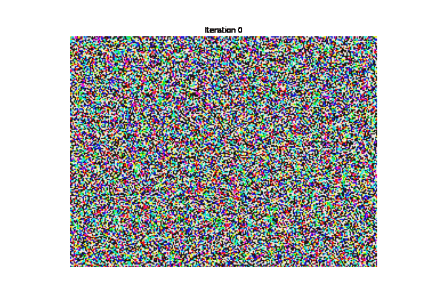

# CS231n-2020-spring-assignment-solution
TODO:

- [x] Assignment [#1](https://cs231n.github.io/assignments2020/assignment1/) (Finished 2020/9/12)
- [x] Assignemnt [#2](https://cs231n.github.io/assignments2020/assignment2/) (Finished 2020/9/27)
- [x] Assignemnt [#3](https://cs231n.github.io/assignments2020/assignment3/) (Finished 2020/10/8)
- [ ] Notes

---

##  Important Notice

- DO NOT use `%%timeit` when use CUDA in pytorch!!! If you use it, the program will run for several times uselessly.

---

## Interesting Examples

### Style Transfer GIFs

<figure class="half">      </figure>

<figure class="half">      </figure>